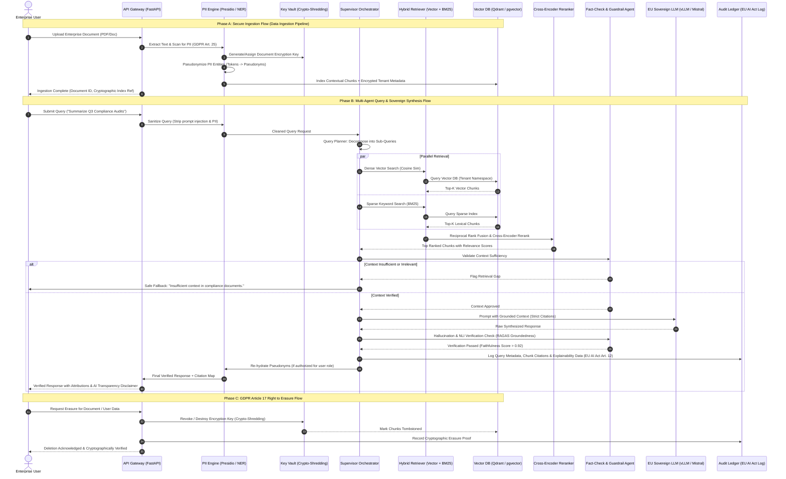

# End-to-End Data Flow Architecture

## 1. Sequence & Data Flow Diagram



---

## 2. In-Depth Subsystem Data Transformations

### 2.1 Ingestion & Privacy Transformation Pipeline
```
[Raw Document: PDF/DOCX]
        │
        ▼ (Text Extraction & Structural Parsing)
[Structured Markdown / Section AST]
        │
        ▼ (Presidio / Local NER Analyzer)
[Identified PII Spans: {type: 'PERSON', text: 'Dr. Jane Smith', start: 42, end: 56}]
        │
        ▼ (Pseudonym Token Generator + Key Vault)
[Pseudonymized Text: "...authorized by <PERSON_a8f9> on 2026-04-12..."]
        │
        ▼ (Contextual Hierarchical Chunker - 512 tokens with 64 overlap)
[Context-Enriched Chunks: {chunk_id, doc_id, section, text_pseudonymized}]
        │
        ▼ (EU-Hosted Sovereign Embedding Model: e.g., BAAI/bge-m3 or local Ollama)
[Dense Vector (1024-dim)] + [Sparse Lexical Tokens (BM25)]
        │
        ▼ (Encrypted Indexing with Tenant AES-256 Key)
[Qdrant / pgvector Vector Store with Tenant Namespace]
```

### 2.2 Inference & Multi-Agent Verification Pipeline
```
[User Query] 
        │
        ▼ (Query Ingress Sanitizer)
[Clean Query] ──▶ [Supervisor Agent] ──▶ [Query Planner]
                                              │ (Sub-query Generation)
                                              ▼
                                 [Hybrid Retriever: Vector + BM25]
                                              │ (Candidate Chunks)
                                              ▼
                                 [Cross-Encoder Reranker]
                                              │ (Top-5 Reranked Chunks)
                                              ▼
                                 [Fact Verifier (Pre-LLM Gate)]
                                              │ (Approved Context)
                                              ▼
                                 [Sovereign EU LLM Inference]
                                              │ (Draft Synthesized Response)
                                              ▼
                                 [NLI Factual Consistency Guardrail]
                                  ├─ Pass (Score ≥ 0.90) ──▶ [Audit Log + Watermark] ──▶ [User]
                                  └─ Fail (Hallucination) ──▶ [Correction Loop / Safe Fallback]
```
