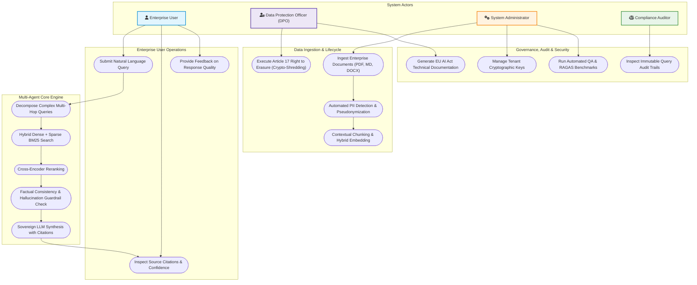

# Detailed Use Case Specification & Diagram

## 1. System Actors

| Actor | Category | Description & Authority |
|---|---|---|
| **Enterprise User** | Primary Business User | Submits questions, searches internal documents, reviews citations, and provides query feedback. |
| **Data Protection Officer (DPO)** | Compliance & Privacy | Oversees GDPR compliance, executes Right-to-be-Forgotten erasure requests, inspects PII logs. |
| **Compliance Auditor** | Regulatory / External | Reviews EU AI Act Art. 12 audit trails, verifies model explainability, inspects bias and hallucination logs. |
| **System Administrator** | DevOps & SecOps | Configures RBAC, manages tenant encryption keys, monitors vector database partitions and model health. |
| **Autonomous Agent Team** | Internal System Actors | PM Agent, Dev Agent, QA Agent, GitOps & Docs Agent, Orchestrator, Retriever, Verifier. |

---

## 2. Mermaid.js Use Case Diagram

---

## 3. Use Case Descriptions

### UC-01: Ingest & Anonymize Enterprise Documents
* **Trigger**: Admin or automated sync ingests a corporate PDF/Doc.
* **Pre-conditions**: Document access rights established; tenant key active.
* **Main Flow**:
  1. Document parsed into structured text sections.
  2. PII Sanitizer scans text using Microsoft Presidio and customized NER entities (IBAN, SSN, EU Tax IDs, names, emails).
  3. Identified PII is replaced with cryptographic pseudonyms (`<PERSON_01>`, `<IBAN_01>`).
  4. Mapping stored in encrypted vault using tenant-specific key.
  5. Anonymized text is chunked contextually and embedded.
* **Post-conditions**: No raw PII enters the vector store.

### UC-02: Execute Multi-Agent RAG Query
* **Trigger**: User inputs a complex enterprise query.
* **Pre-conditions**: User authenticated via OIDC/OAuth2 with assigned RBAC scope.
* **Main Flow**:
  1. Gateway sanitizes query against injection vectors.
  2. Supervisor agent decomposes query into focused retrieval queries.
  3. Hybrid retriever runs parallel dense semantic and BM25 sparse queries against tenant vector space.
  4. Cross-encoder scores and reranks top $K$ candidate passages.
  5. Verifier Agent checks context relevance.
  6. Sovereign LLM synthesizes response with strict bracketed citations `[Doc:Section]`.
  7. Verifier Agent performs NLI check for hallucination containment.
  8. Final response with confidence scores, citations, and EU AI watermark returned to user.

### UC-03: GDPR Article 17 Right to Erasure (Crypto-Shredding)
* **Trigger**: DPO initiates data erasure for a user, document, or tenant.
* **Main Flow**:
  1. DPO submits targeted erasure request with verifiable identity proof.
  2. Key Vault destroys the dedicated encryption key associated with the target document/user.
  3. Corresponding vector chunks become cryptographically unreadable and marked as tombstoned.
  4. Audit ledger logs cryptographic deletion hash without logging any deleted PII.
* **Post-conditions**: Compliance achieved without requiring full rebuild of vector indexes.
